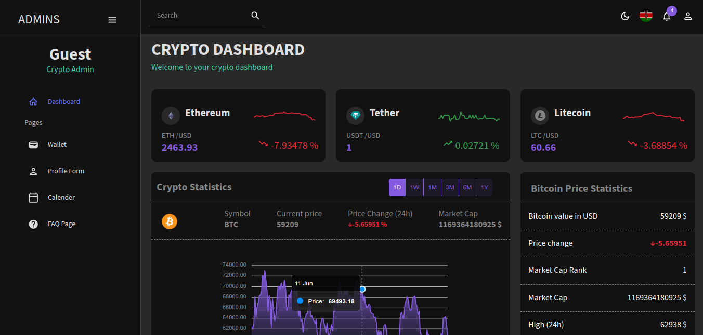
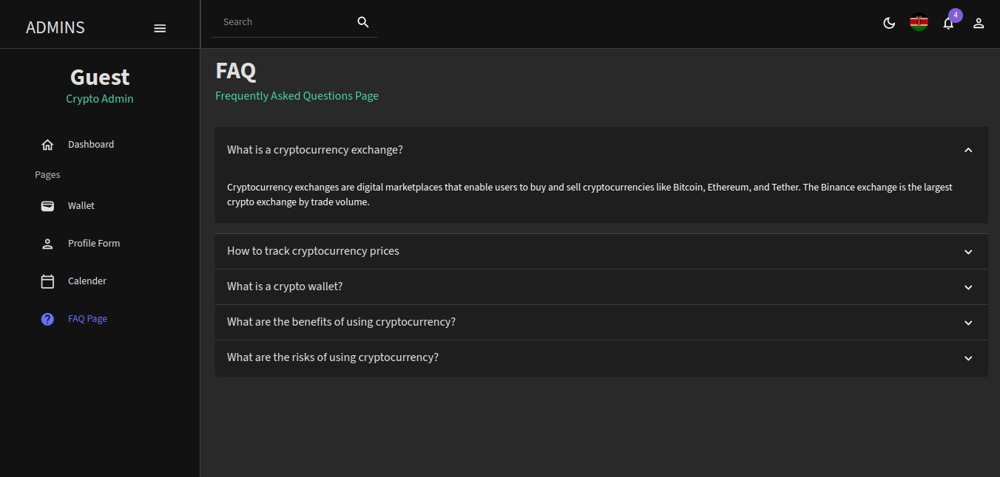
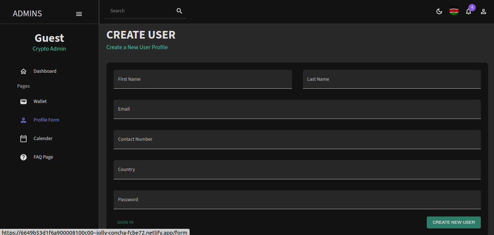

# CRYPTO DASHBOARD

This dashboard shows a list of cryptocurrencies.



From the list of cryptocurrencies, a user can select a coin to get more details on the coin.


There is a search feature that allows users to search for a specific coin


There is a FAQ page providing information on frequently asked questions



There is a sign up form with validation that customizes the dashboard after signing up



Before running this project ensure that the following packages are installed:

```
npm i @mui/material @emotion/react @emotion/styled @mui/x-data-grid @mui/icons-material react-router-dom@6 react-pro-sidebar formik yup 
```

```
npm install --save apexcharts react-apexcharts
```

```
npm install axios
```

Make sure that the package versions dont conflict each other or else the application might not run. You can check the package.json file to see the version I used.

After the set up is complete you can run the project:


### `npm start`

Runs the app in the development mode.\
Open [http://localhost:3000](http://localhost:3000) to view it in your browser.

The page will reload when you make changes.\
You may also see any lint errors in the console.

### `npm test`

Launches the test runner in the interactive watch mode.\
See the section about [running tests](https://facebook.github.io/create-react-app/docs/running-tests) for more information.

### `npm run build`

Builds the app for production to the `build` folder.\
It correctly bundles React in production mode and optimizes the build for the best performance.

# Dahboard site
I deployed the crypto_dashboard using Netlify. Feel free to sample it.

## [https://jolly-concha-fcbe72.netlify.app/]